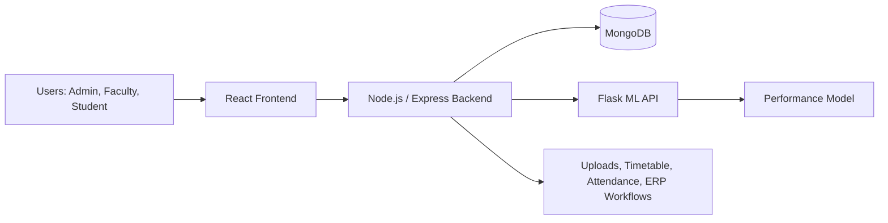
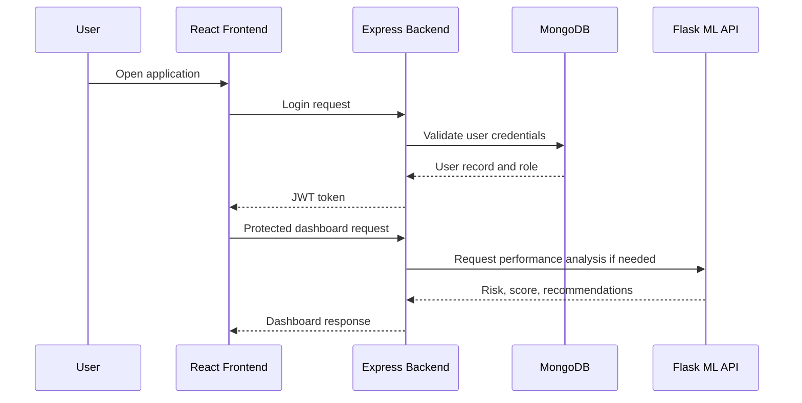

# Campus Connect: A Smart College Management and Student Performance Analytics System

**Karan Sathe, Rituja Sonawane, Samruddhi Harishchandre, Dnyaneshwari Telbhare, Prof. M. S. Bhosale**  
Department of Information Technology, Sinhgad College of Engineering, Pune-41  
Email: karansathe.scoe.it@gmail.com

---***---

## ABSTRACT
Contemporary academic institutions often rely on fragmented tools for attendance, student records, timetable planning, communication, and performance monitoring. This creates data silos, manual workload, and delayed intervention for students who need academic support. This paper presents Campus Connect, an implementation-based college management system that consolidates administrative operations and student performance analytics into one software ecosystem. The platform is built using the MERN stack for transactional workflows and a Flask-based machine learning service for performance analysis. The implementation provides role-based access for students, faculty, and administrators, along with modules for authentication, student and faculty management, course and timetable handling, attendance sessions with QR-based flows, change-request governance, notifications, assignments, ERP work items, and analytics-driven student performance views. The system is designed for practical deployment, modular maintenance, and future extensibility. The paper focuses on implementation details, system architecture, database design, module interactions, and validation performed through project scripts and service integration.

**Keywords:** College Management System, MERN Stack, Machine Learning, Role-Based Access, Attendance Automation, Student Analytics, Flask Microservice

## 1. INTRODUCTION
Educational institutions manage large volumes of academic and administrative data every day. Student records, attendance, course allocations, timetable schedules, notifications, and performance analysis must all remain consistent and accessible to different users. In many colleges, these tasks are still handled using separate spreadsheets, manual approvals, and disconnected software tools. As a result, it becomes difficult to maintain data integrity, monitor student progress in time, and coordinate between faculty and administration.

Campus Connect was developed to address these practical issues by integrating the main institutional workflows into a single web application. The system combines operational management and analytics so that users can work in one environment instead of switching between multiple tools. The application provides secure login, role-specific dashboards, record management, attendance workflows, timetable support, and machine-learning-assisted performance evaluation.

The main objectives of the project are:
1. To design and implement a unified college management platform with role-based access control.
2. To provide reliable management of student, faculty, course, attendance, timetable, assignment, and notification data.
3. To integrate a machine learning service for student performance analysis.
4. To support administrative workflows such as change requests and ERP work tracking.
5. To build a modular, maintainable system that can be extended for future institutional needs.

## 2. LITERATURE SURVEY
The development of digital systems for higher education has evolved from simple record-keeping applications to integrated institutional platforms. Earlier systems mainly focused on admissions and basic student information storage. Later work expanded toward dashboards, reporting, and process automation. However, many systems still operate as separate modules without a unified analytics layer.

Yue (2016) discussed student information management software and highlighted the importance of structured institutional data handling. Their work showed that consistent records and centralized access improve administrative efficiency, but it did not cover intelligent performance prediction.

Kedar et al. (2021) presented Smart Analyzer, showing how machine learning and data analysis can support institutional decision-making. Their work demonstrated the value of using analytics for management insight, but the predictive features were not tightly integrated into a daily operational college workflow.

Educational Data Mining research has repeatedly shown that attendance, marks, and progression history are strong indicators of student performance. Studies by Ahmed et al. (2021), Mulyana et al. (2023), and Jayaprakash et al. (2020) reported that ensemble-based methods, especially Random Forest models, perform well for academic prediction tasks. This suggests that student data can be used effectively for early intervention if it is correctly collected and processed.

The literature shows two persistent gaps. First, operational management and predictive analytics are often built separately. Second, many tools provide reports but do not embed intelligence directly into the daily institutional workflow. Campus Connect addresses this gap by combining management and analytics in one implementation, making the system more usable for real campus operations.

## 3. OVERVIEW
Campus Connect is designed as an integrated platform for students, faculty, and administrators. The system is organized around five major functional areas: authentication, academic records, operational workflows, administrative governance, and ML-based analytics.

The authentication system uses JWT-based access control and role validation to ensure that users only reach the features meant for their role. Students can view personal academic information, attendance summaries, and analytics outputs. Faculty users can manage attendance sessions, student-related workflows, and academic records. Administrators can manage system data, handle change requests, and monitor the overall platform.

The analytics component is implemented as a separate Flask microservice. It processes student marks, attendance, semester performance, backlog counts, and improvement indicators to generate student performance insights. This design allows the analytics layer to evolve independently from the main backend.

Key working principles of the system include:
1. Centralized data access to reduce duplication and inconsistency.
2. Role-specific interfaces that improve usability.
3. Modular services that simplify maintenance and updates.
4. Analytics outputs that support timely intervention.
5. Responsive design for use across desktop and mobile browsers.

**Fig. 1: System Architecture**

## 4. METHODOLOGY
The development methodology combines software engineering practices with modular service design.

### 4.1 System Requirements Analysis
The platform was implemented to cover the following functional requirements:
1. User authentication and role-based authorization.
2. Student profile and academic record management.
3. Faculty record and workflow management.
4. Course, timetable, and attendance handling.
5. Assignment submission and notification support.
6. ML-based student performance analysis.
7. Administrative approval and change-request handling.

The non-functional focus was on modularity, security, maintainability, and practical deployment readiness.

### 4.2 Database Design and Normalization
The database uses MongoDB with document-oriented collections for academic and operational data. The implementation includes models such as Student, Faculty, User, Subject, Course, Timetable, AttendanceSession, ChangeRequest, Notification, Assignment, AssignmentSubmission, CohortAssignment, ERPWorkItem, and MLTrainingRun.

The structure is suitable for nested academic data because semester marks, attendance snapshots, and timetable entries naturally fit document storage. Each model is separated by functional domain, which reduces coupling between modules and simplifies updates.

### 4.3 Machine Learning Integration
The ML module is implemented as a Flask service that receives student data from the Node backend. The performance model uses attendance, CGPA, semester marks, backlog count, improvement trend, and consistency as inputs. The system produces explainable outputs such as performance score, risk level, placement probability, and recommendations.

This implementation-based design was chosen because it allows the analytics layer to remain independent from the main transactional system while still being accessible inside user workflows.

### 4.4 User Interface Design
The frontend uses React and route-based rendering to present different dashboards for different roles. Protected routes ensure that unauthorized users cannot access restricted sections. The interface is organized so that students see personal academic data, faculty see operational tools, and administrators see management controls.

## 5. SYSTEM OVERVIEW
### 5.1 Core Components
Campus Connect is composed of four major subsystems:
1. Management Module: handles records, attendance, assignments, and operational data.
2. Dashboard Module: provides role-based visual summaries and quick access to key functions.
3. Analysis Module: performs ML-based performance assessment.
4. Communication Module: manages notifications and action-driven updates.

### 5.2 System Architecture
The architecture is divided into four layers:
1. Presentation Layer: React frontend with protected dashboards.
2. Application Layer: Express APIs for business logic and workflows.
3. Data Layer: MongoDB collections for persistent records.
4. ML Service Layer: Flask analytics service for performance predictions.

Data flows from the frontend to the backend, then to MongoDB and the ML service when analytics are required. The backend acts as the main coordinator between user requests, database access, and analytics calls.

### 5.3 Security Architecture
The system uses layered security:
1. JWT tokens for stateless authentication.
2. Role-based authorization for protected routes.
3. Password hashing with bcrypt.
4. CORS allow-list policies.
5. File upload restrictions for supported import formats.

## 6. SYSTEM MODULES AND FUNCTIONALITIES
### 6.1 Authentication Module
The authentication module supports login, token verification, and role-aware access control. It is used to protect student, faculty, and admin workflows.

### 6.2 Student Module
The student module provides access to profile information, academic data, attendance history, performance analytics, and related records.

### 6.3 Faculty Module
The faculty module supports attendance session creation, student monitoring, workflow handling, and academic management tasks.

### 6.4 Admin Module
The admin module provides database-level control, user management, timetable management, approval handling, and overall system monitoring.

### 6.5 Attendance Module
The attendance module supports QR-based session creation and scoped attendance recording. Sessions can be limited by year, branch, and division, and expired sessions are handled separately.

### 6.6 Timetable Module
The timetable module supports timetable parsing, draft generation, validation, and conflict warnings. This reduces manual scheduling effort and improves consistency.

### 6.7 Assignment and Notification Modules
Assignments and notifications are handled as separate features so that academic tasks and communication can be managed independently.

### 6.8 ML Prediction Module
The ML module predicts student performance based on academic and attendance-related inputs. It also generates recommendations for academic support.

## 7. DATABASE DESIGN
### 7.1 Entity Relationships
The database design follows clear relationships between primary entities.

1. Student to AttendanceSession: one student may relate to many attendance records.
2. Student to AssignmentSubmission: one student may submit many assignments.
3. Faculty to Subject: one faculty member may be mapped to multiple subjects.
4. Subject to Timetable: one subject may appear in multiple timetable entries.
5. User to Student/Faculty: each user account maps to a specific academic identity.

### 7.2 Collection Design
The main collections are structured as follows:
1. Student: stores PRN, roll number, name, year, branch, division, contact details, and academic fields.
2. Faculty: stores faculty identity, name, department, designation, and contact information.
3. Subject and Course: store subject metadata, credits, semester, and ownership details.
4. AttendanceSession: stores QR session state, scope, expiry, and attendance requests.
5. Timetable: stores schedule structure, entries, and validation metadata.
6. ChangeRequest: stores profile and password update requests with approval status.
7. ERPWorkItem: stores workflow tasks generated from governance events.
8. MLTrainingRun: stores analytics run metadata and traceability information.

### 7.3 Indexing and Data Access
Indexes are used on frequently queried fields such as PRN, faculty identifiers, subject codes, and session codes. This improves lookup efficiency for student profiles, attendance retrieval, and workflow resolution.

## 8. IMPLEMENTATION AND VALIDATION
### 8.1 Implementation Stack and Runtime Flow
Campus Connect is implemented as a three-service system. The transactional application uses Node.js and Express, the user interface uses React, and the analytics layer uses Flask. The backend persists data in MongoDB and communicates with the ML service through HTTP requests when student performance analysis is required. The current implementation is organized so that the operational backend, the frontend, and the analytics service can be started and tested independently.

The backend is started through the project script that first clears the target port and then launches the Express server. This reduces port-conflict failures during local development. The frontend is built and served as a separate React application, while the Flask ML API runs independently with its own Python dependencies.

### 8.2 Backend Implementation
The backend is implemented in Node.js and Express with modular route files. The application includes route groups for authentication, students, faculty, ML analytics, dashboard management, change requests, notifications, courses, assignments, attendance sessions, timetable management, placement showcase, cohort assignments, and ERP work items.

The runtime middleware stack includes CORS handling, compression, JSON parsing, JWT authentication, role-based authorization, Multer-based file upload handling, and XLSX-based spreadsheet parsing. This supports workflows such as profile-photo uploads, assignment submissions, course document uploads, timetable import, and attendance or administrative data processing.

The backend routes are exposed under practical API prefixes such as /api/auth, /api/students, /api/faculty, /api/ml, /api/ml-analysis, /api/dashboard, /api/change-requests, /api/notifications, /api/courses, /api/assignments, /api/attendance-sessions, /api/placement-showcase, /api/cohort-assignments, and /api/work-items. Timetable routes and public timetable access are also mounted separately so that the scheduling workflow can support both authenticated and public access paths.

### 8.3 ML API Implementation
The ML service is implemented in Flask and exposes prediction endpoints as a separate microservice. It uses Python packages for numerical computation, data preparation, and model execution, and it can respond to single-student and batch requests. The service also provides model information and health responses so that the backend can verify service availability before sending analysis requests.

The ML layer consumes academic indicators such as attendance, CGPA, semester marks, backlog count, improvement trend, and consistency. It returns performance score, risk level, placement probability, and recommendations, allowing the analytics output to be consumed directly inside the student and admin workflows.

### 8.4 Frontend Implementation
The frontend is built as a React application with route protection and role-specific dashboards. The routing structure ensures that users are redirected to the correct area based on authentication state and assigned role.

The frontend uses React Router for navigation, Axios for API communication, charting libraries for dashboard visualizations, and file-processing utilities for user-driven uploads and exports. Protected routes are used to prevent unauthorized access to student, faculty, and admin sections while still allowing the application to render correctly after the authentication context finishes loading.

### 8.5 Validation Performed
The repository includes implementation-level checks and validation scripts. These include:
1. Backend flow checks for login, dashboard, CRUD, and analysis flows.
2. Frontend build validation.
3. Protected route smoke checks.
4. ML route compatibility checks for student analysis.
5. Local service integration between backend and ML API.

These checks confirm that the major modules are connected and operational in the current implementation, and they document the project as a working implementation rather than a conceptual design only.

**Fig. 2: Role-Based Route Flow**

## 9. RESULTS AND DISCUSSION
The implementation demonstrates that a modular MERN architecture can be combined with a Flask-based analytics service without forcing all logic into a single monolithic backend. The most important practical outcomes are:
1. Secure role-based access for the major user groups.
2. Centralized handling of academic operations.
3. Attendance and timetable workflows that reduce manual coordination.
4. Performance analytics that can be used for early student support.
5. Governance mechanisms for profile and password changes.

From an implementation perspective, the system shows that campus workflows can be digitized step by step rather than through one large replacement. This makes adoption easier for institutions because each module can be deployed and validated independently.

## 10. CONCLUSION AND FUTURE SCOPE
Campus Connect successfully implements a smart college management and student performance analytics system by combining transactional workflows, workflow governance, and machine-learning-assisted analysis. The project shows how a modular MERN application can be extended with a Flask analytics service to support institutional decision-making.

The implementation emphasizes usability, secure access, and extensibility. It does not depend on a single tightly coupled system, which makes future maintenance easier. The current version is well suited as a final-year project implementation and as a base for further research and deployment.

Future work can focus on:
1. Richer predictive analytics using larger datasets.
2. Mobile-first attendance and notification support.
3. Better reporting dashboards with more visualization features.
4. Advanced timetable optimization and constraint handling.
5. Deeper audit logging and production-grade security hardening.
6. Integration with external institutional systems such as LMS or ERP platforms.

## REFERENCES
[1] F. Yue, "A study of student information management software," IEEE Conference, 2016.  
[2] S. Kedar, S. Sutar, and H. Prasad, "Smart Analyzer: Assisting College Management through Machine Learning and Data Analysis," Turkish Journal of Computer and Mathematics Education, vol. 12, no. 1S, pp. 137-145, 2021.  
[3] D. M. Ahmed, A. M. Abdulazeez, and D. Q. Zeebaree, "Predicting University's Students Performance Based on Machine Learning Techniques," IEEE I2CACIS Conference, 2021.  
[4] A. F. Mulyana et al., "Increased accuracy in predicting student academic performance using Random Forest algorithm," Journal of Scientific Research in Education, vol. 9, 2023.  
[5] A. Khudhur et al., "Students' Performance Prediction Using Machine Learning Algorithms," IEEE Conference, 2023.  
[6] S. A. A. Balabied et al., "Utilizing random forest algorithm for early detection of at-risk students," Nature Scientific Reports, 2023.  
[7] M. Chen et al., "Predicting performance of students by optimizing tree-based learning algorithms," Elsevier Science Direct, 2024.  
[8] Campus Connect project source code and implementation documentation, 2026.
[9] K. Sathe, R. Sonawane, S. Harishchandre, D. Telbhare, and M. S. Bhosale, "Campus Connect: A Smart College Management and Student Performance Prediction System."

## APPENDIX A: FIGURE AND SCREENSHOT GUIDE
Use the following placement for screenshots in the final submission:
1. Login and role dashboard screenshot after the frontend section.
2. API health or authenticated route screenshot after the backend section.
3. ML output screenshot after the student performance analytics section.
4. Timetable draft screenshot after the timetable module discussion.
5. Attendance QR session screenshot after the attendance module discussion.
6. Change request workflow screenshot after the governance section.
7. Flow-check or build output screenshot in the validation section.

## APPENDIX B: IMPLEMENTATION NOTES
1. Backend startup uses the project script that clears the target port before launch.
2. Frontend and backend run as separate services.
3. ML API runs as an independent Flask process.
4. Environment configuration should be stored separately for each service.
5. The analytics route layer accepts student identifiers and can work with the current data model.
6. Backend dependencies include Express, Mongoose, JWT, bcryptjs, Multer, QR code generation, XLSX parsing, CORS, compression, and Axios.
7. Frontend dependencies include React Router, Axios, Chart.js, React Chart.js 2, react-dropzone, file-saver, and XLSX utilities.
8. The ML service dependencies include Flask, Flask-CORS, NumPy, Pandas, Scikit-learn, Joblib, and Matplotlib.
